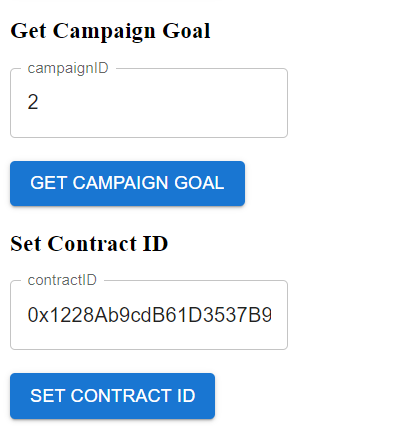

## Description
This is a frontend integration app with your smart contracts you deployed in mainnet or testnet.

## Pre-requisites

1 - This app uses MetaMask to connect to your wallet. You can download it here: https://metamask.io/

2 - Connect to your wallet and make sure you have some ETH to pay for the gas fees. Recommend way to do this 
connect a testnet like Ropsten or Rinkeby and get some ETH from a faucet.

3 - You need to have a smart contract deployed in mainnet or testnet. You can use Remix to deploy your smart contract.

4 - Get your ABI and contract address and replace with abi.json file in src folder of frontend app.

5 - First you need to set your contract address at the end of page in app.

6 - Then you can call your smart contract functions.

## Screenshots

